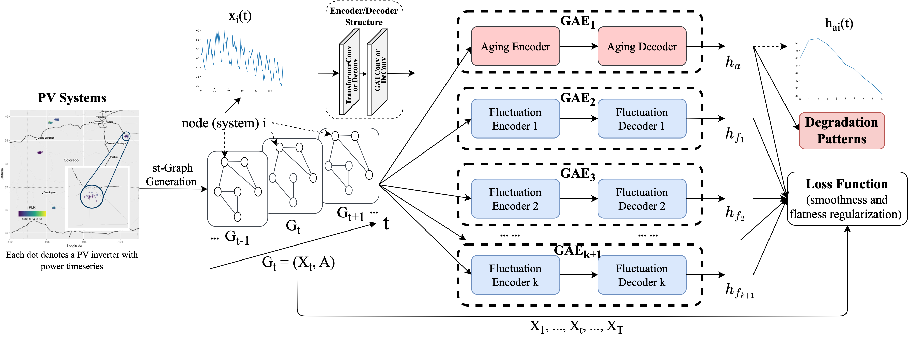
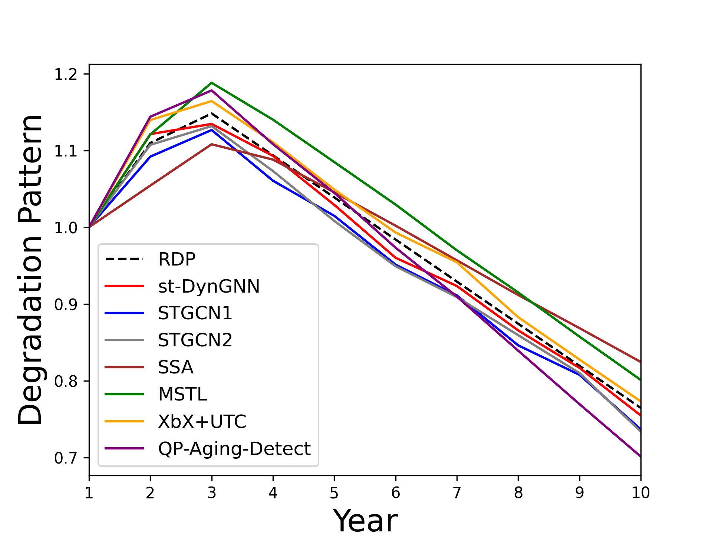

# ST-GTrend
This repository contains the code for the reproducibility of the experiments presented in the paper "Parallel-friendly Spatio-Temporal Graph Learning for Large-scale Photovoltaic Degradation Analysis". 
In this paper, we propose a novel Spatio-Temporal Dynamic Graph Neural Networks (ST-GTrend) framework for long-term trend analysis and achieve state-of-the-art results on spatio-temporal datasets.

<h2 align=Left>st-DynGNN in a nutshell</h2>

Our paper introduces __ST-GTrend__, which integrates spatiotemporal coherence and graph attention to separate PLR as a long-term “aging” trend from multiple fluctuation terms in the PV input data. 
To cope with diverse degradation patterns in timeseries, st-DynGNN adopts a paralleled graph autoencoder array to extract aging and fluctuation terms simultaneously. 
To further improve the accuracy, st-DynGNN imposes
flatness and smoothness regularization to ensure the disentanglement between aging and fluctuation.

  
**Fig. 1: Overview of st-DynGNN Imputation Framework.**

## Organization of the code

All the code for the models described in the paper can be found in *codes/Case1_Global_Linear_PLR.ipynb*, *codes/Case2_PointofChange_Linear_PLR.ipynb*, and *codes/Case3_Non_Linear_PLR.ipynb*. We provide the datasets used in our experiments for users to validate our proposed imputation framework consists of both meta data information (locations) and timeseries data located in: *Dataset_All/Case1_Linear*, *Dataset_All/Case2_Linear_w_Breakpoint*, and *Dataset_All/Case3_Non_Linear*. 

## Results  
We have evaluated our proposed model on PV datasets with three different degradation patterns. Experimental results show that st-DynGNN obtains a reduction of 34.74% and 33.66% on average in Mean Absolute Percent Error (MAPE) and Euclidean Distances in PLR degradation estimation compared to the state-of-the-art PLR estimation methods. 
  

**Fig. 2: Example of Extracted Aging (in red) and Fluctua- tion Terms (in black) by st-DynGNN for a PV System (Case 2 linear with breakpoint degradation pattern shown above).**

## Prerequisites
Our code is based on Python3 (>= 3.8). The major libraries are listed as follows:
* NumPy (>= 1.22.3)
* Pandas (>= 1.4.2)
* Torch (>= 1.10.0)
* PyG (PyTorch Geometric) (>= 2.0.4)
* Scikit-learn (>= 1.0.2)

